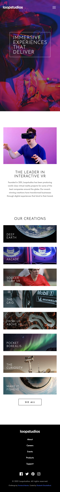

# Frontend Mentor - Loopstudios landing page solution

This is my solution to the [Loopstudios landing page challenge on Frontend Mentor](https://www.frontendmentor.io/challenges/loopstudios-landing-page-N88J5Onjw). These challenges help improve coding skills by building realistic, front-end projects.

## Table of Contents

- [Overview](#overview)
  - [The Challenge](#the-challenge)
  - [Additional Features](#additional-features)
  - [Screenshots](#screenshot)
  - [Links](#links)
- [My process](#my-process)
  - [Tech Stack](#tech-stack)
  - [Key Development Steps](#key-development-steps)
  - [Key Takeaways](#key-takeaways)
  - [Continued Development](#continued-development)
  - [Useful Resources](#useful-resources)
- [Author](#author)

## Overview

### The Challenge

This Loopstudios landing page challenge focuses on implementing a responsive landing page using HTML, Sass/SCSS, and JS. The key objectives include:

- Providing an optimal layout across different screen sizes.

- Implementing hover states for all interactive elements on the page.

- Creating a functional, accessible menu toggle that toggles between open and closed states, with a sliding navigation panel for improved usability on mobile screens.

### Additional Features

To further test my Sass/SCSS and JS skills, I implemented a dynamic nav that changes on scroll, which wasn't part of the original challenge. I added additional JS to change the appearance of the navbar when a user scrolls the page to improve user experience and practice working with JS for scroll-based interactions.

### Screenshots

- **Mobile View**:

  

- **Tablet View**:

  

- **Desktop View**:

  

### Links

- **Solution URL**: [Solution: GitHub Repository](https://github.com/E-C-Shackelford/frontendmentor-loopstudios-landing-page)
- **Live Site URL**: [Live Site: Deployed Application](https://e-c-shackelford.github.io/frontendmentor-loopstudios-landing-page/)

## My Process

### Tech Stack

- **HTML5**: I structured my content with semantic elements, establishing code clarity, readability, accessibility, and maintainability.

- **BEM Methodology with Namespaces**: I broke my page into Blocks, Elements, and Modifiers and utilized namespaces to distinguish components, utilities, and layout elements and create a modular, transparent, reusable, and scalable CSS architecture.

- **Sass (SCSS syntax)**: I used the SCSS syntax and incorporated partials and imports, variables, nesting, and parameterized mixins to create more modular, organized, flexible, scalable, maintainable, and dynamic stylesheets, while focusing on DRY coding practices.

- **Mobile-First Design**: I focused on the core content, and prioritized optimal performance and usability on mobile devices before scaling up to larger screens in order to provide a consistent and seamless user experience across all devices.

### Key Development Steps

- **HTML5 Structure**: I began the project with a semantic HTML foundation.

- **Mobile-First Development**: I utilized a mobile-first approach to develop a sacalable and fluid layout that adapts seamlessly across all devices.

- **Media Queries**: I applied responsive breakpoints in order for the layout to adapt seamlessly across tablet and desktop views, improving usability on various screen sizes.

- **SCSS File Organization**: I structured my code with purposeful partials to improve organization, readability, and maintainability.

- **Variables and Mixins**: I used variables for design consistency and parameterized mixins to centralize styling logic, making my code more reusable and maintainable.

- **Nesting and Inheritance**: I used nesting to create clearer, hierarchical styling, and inheritance to reduce redundancy and maintain consistency.

- **Interactivity with JS**: I enhanced user interaction by implementing a responsive menu toggle, sliding navigation panel, and scroll-triggered navigation effect.

- **Expanding Challenge with JS**: I added a scroll-triggered background change on the navigation to further develop my JS skills and improve user experience, ensuring easy access to the navigation from any place on the page.

- **Testing and Iteration**: I conducted cross-browser testing for consistency, used developer tools to ensure responsive design across different screen sizes, and repeatedly reviewed and refined my code for improved clarity, and compressed image files for faster load times.

### Key Takeaways

- **SCSS Syntax and Organization**: I learned how parameterized mixins, variables, and nesting create clean, consistent, and maintainable code, and organized partials enhance project structure and improve readability.

- **Flexible Layouts with CSS Grid**: I explored how CSS Grid creates flexible, complex layouts, including effective management of overlapping elements.

- **JS for Enhanced Interactivity**: I implemented JS functionality for a responsive menu toggle and sliding navigation panel, along with an additional challenge of creating a scroll-triggered background change for the nav, improving user experience.

### Continued Development

I'm excited to build more projects and advance my skills in Sass/SCSS and JS. As I continue my journey in SCSS, I want to explore SCSS best practices, theming and dynamic color schemes, control directives and loops, creating functions, advanced media queries, color manipulation, and CSS animations and transitions in SCSS.

### Useful Resources

- [**Sass Official Documentation**](https://sass-lang.com)

- ["CSS Preprocessors" section of the **Advanced CSS Techniques** learning path in the **Learning Path** section of **Frontend Mentor**](https://www.frontendmentor.io)

## Author

- LinkedIn - [Elizabeth Shackelford](https://www.linkedin.com/in/e-c-shackelford)
- Frontend Mentor - [@E-C-Shackelford](https://www.frontendmentor.io/profile/E-C-Shackelford)
